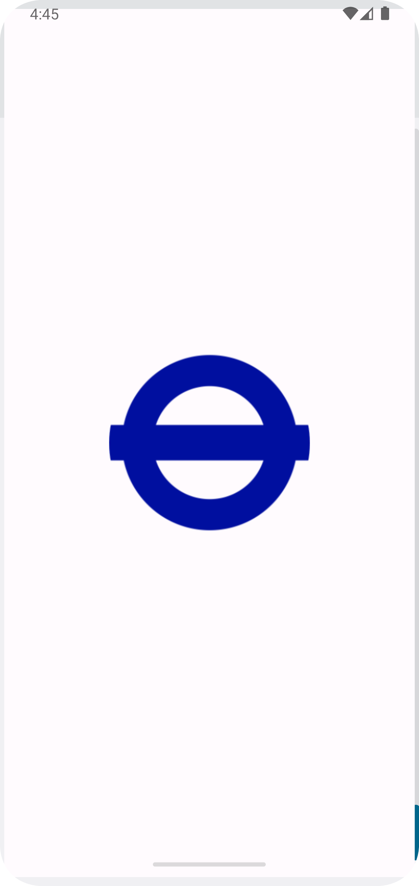
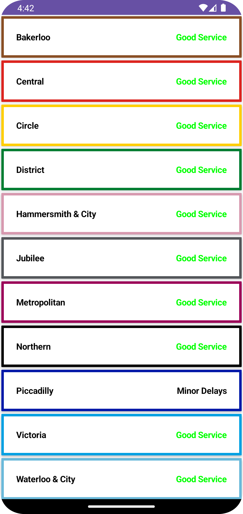

# TFL Status

TFL status is an Transport For London Api.

I have used MVVM architecture .
I used DI methoad and Repository to fetch the Api data.
I used Composable for UI Design.

This Api as:

* Line names
* Statusof lines

  
  

Tfl status Application is still under development in testing

Libraries:
* Compose Toolkit
* Hilt
* Dependency Injection
* Kotlin Coroutines

Copyright 2023 Praveen Krishnamoorthy

